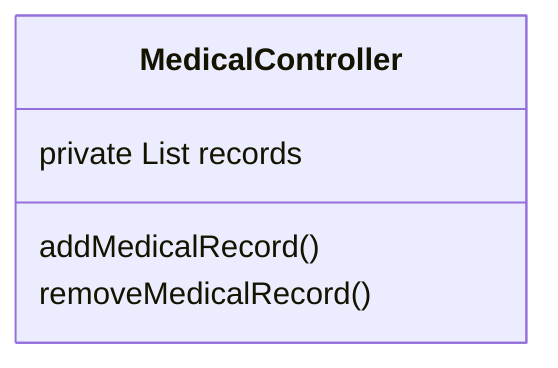
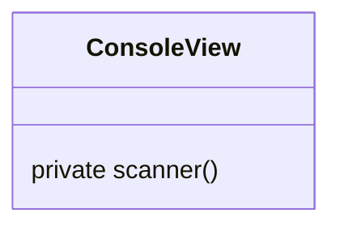

# MVC 개발, 애완 동물 진료관리 시스템

## 기능 정의

### MODEL
1. 고객 정보 Customer ((이름, 전화번호, 동물 이름 -> 복합키), 주소, 종류, 출생년도)
2. 진료기록 TreatHistory (진료일, 진료내용, 소유주, 동물이름, 주소, 종류, 출생년도)

### VIEW
1. 신규 고객 정보 입력 화면
2. 진료 기록 저장 화면
3. 진료 기록 조회 화면
4. 진료 기록 삭제 화면
5. 종료 화면

### CONTROLLER
1. 고객 정보 입력 기능
2. 진료 기록 저장 기능
3. 진료 기록 조회 기능
4. 진료 기록 삭제 기능
5. 프로그램 종료 기능

+ 중복 검사 안합니다!

### Solution

MedicalRecord VO

### API