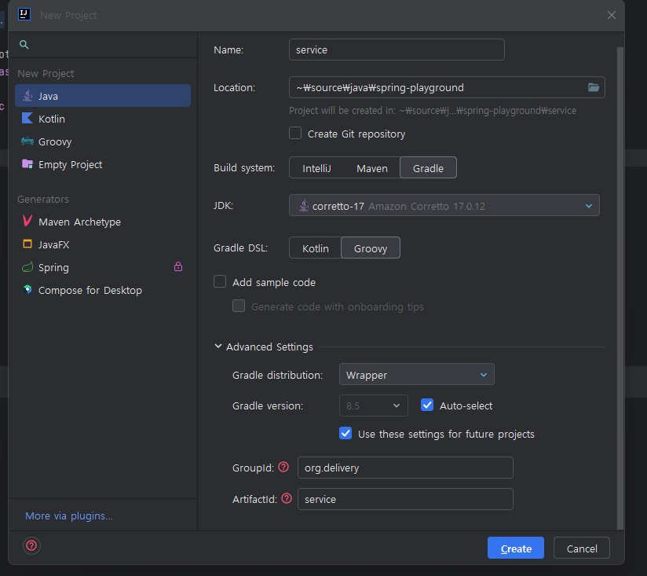
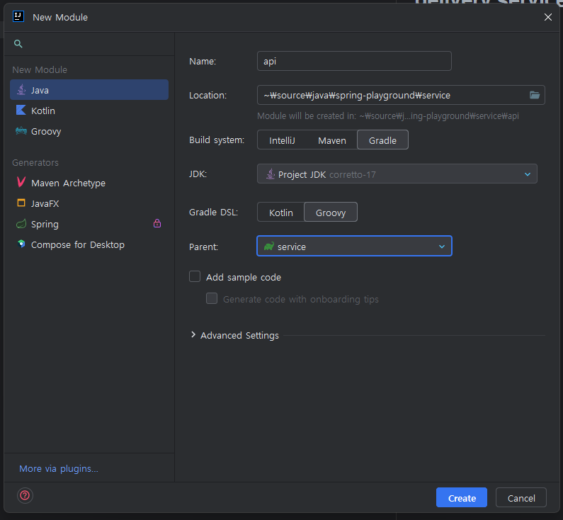
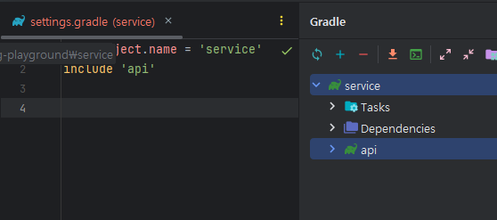
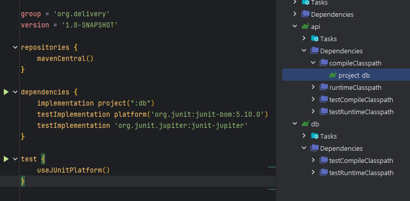

# delivery service

바닥부터 만들어보기

## 멀티 모듈 설정

프로젝트 생성

alt + f -> alt + n -> alt + j


새로운 모듈 추가 

service dir -> alt + insert -> Module... click



root settings.gradle 보면 하위 종속성으로 모듈 추가된거 나옴



그리고 똑같이 db 모듈도 만들어줌

db 모듈에 

이런 클래스 추가
```java
package org.delivery.db;

public class UserDto {
}
```

root build.gradle 파일에 다음 내용 추가

```txt
// service 하위 모든 저장소는 maven 을 쓰겠다
allprojects {
    repositories {
        mavenCentral()
    }
}
```

api 모듈에 db를 의존성으로 추가

아래사진처럼 compileClasspath project.db 추가 된 것을 확인한다.


